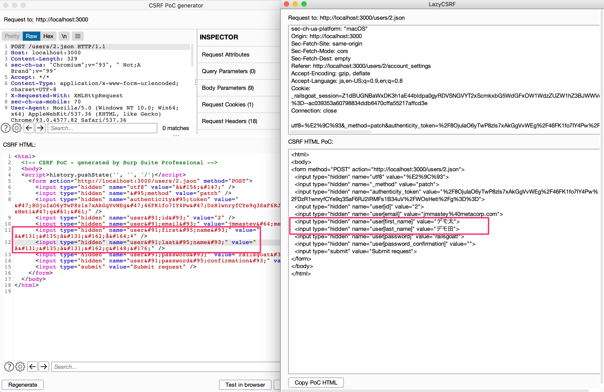

# LazyCSRF

[](https://github.com/tkmru/lazycsrf/releases/latest)
[](https://github.com/tkmru/lazycsrf/blob/main/LICENSE.md)
[](https://www.blackhat.com/eu-21/arsenal/schedule/index.html#lazycsrf-a-more-useful-csrf-poc-generator-on-burpsuite-25088)

LazyCSRF is a more useful CSRF PoC generator that runs on Burp Suite.

## Motivation
Burp Suite is an intercepting HTTP Proxy, and it is the defacto tool for performing web application security testing.
The feature of Burp Suite that I like the most is `Generate CSRF PoC`. 
However, this does not support JSON parameters. 
It also uses the `<form>`, so it cannot send PUT/DELETE requests.
In addition, multibyte characters that can be displayed in the burp itself are often garbled in the generated CSRF PoC.
Those were the motivations for creating this extension.

## Features

- Support JSON parameter (like a request to the API)
- Support PUT/DELETE (only work with CORS enabled with an unrestrictive policy)
- Support displaying multibyte characters (like Japanese)
- Generating CSRF PoC with Burp Suite Community Edition (of course, it also works in Professional Edition)

### Difference in display of multibyte characters

The following image shows the difference in the display of multibyte characters between Burp's CSRF PoC generator and LazyCSRF.
LazyCSRF can generate PoC for CSRF without garbling multibyte characters.
This is only the case if the characters are not garbled on Burp.



## Installation

Download the JAR from [GitHub Releases](https://github.com/tkmru/lazyCSRF/releases/).
In Burp Suite, go to the Extensions tab in the Extender tab, and add a new extension. 
Select the extension type `Java`, and specify the location of the JAR.

## How to Build
### intellij

If you use IntelliJ IDEA, you can build it by following `Build` -> `Build Artifacts` -> `LazyCSRF:jar` -> `Build`.

### Command line

You can build it with maven.

```
$ mvn install
```

## Usage
You can generate a CSRF PoC by selecting `Extensions`->`LazyCSRF`->`Generate CSRF PoC with Form` or `Generate POST PoC with XHR` from the menu that opens by right-clicking on Burp Suite.


## LICENSE

MIT License

Copyright (C) 2021 tkmru
