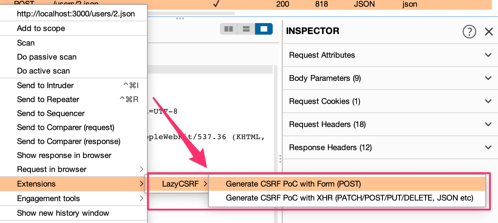

# LazyCSRF
LazyCSRF is a more useful CSRF PoC generator that runs on Burp Suite.

## Motivation
Burp Suite is an intercepting HTTP Proxy, and it is the defacto tool for performing web application security testing.
The feature of Burp Suite that I like the most is `Generate CSRF PoC`. 
However, this does not support JSON parameters. 
It also uses the `<form>`, so it cannot send PUT/DELETE requests.
In addition, multibyte characters that can be displayed in the burp itself are often garbled in the generated CSRF PoC.
Those were the motivations for creating this extension.

## Features

- Generating CSRF PoC with Burp Suite Community Edition (of course, it also works in Professional Edition)
- Support JSON parameter (like GraphQL Request)
- Support PUT/DELETE (only work with CORS enabled with an unrestrictive policy)
- Support displaying multibyte characters (like Japanese)

## Installation

Download the jar from [GitHub Releases](https://github.com/tkmru/lazyCSRF/releases/).
In Burp Suite, go to the Extensions tab in the Extender tab, and add a new extension. 
Select the extension type `Java`, and specify the location of the jar.

## How to Build
### intellij

If you use IntelliJ IDEA, you can build it by following `Build` -> `Build Artifacts` -> `LazyCSRF:jar` -> `Build`.

### Command line

You can build it with maven.

```
$ mvn install
```

## Usage
You can generate a CSRF PoC by selecting `Extensions`->`Generate JSON CSRF PoC with Ajax` or `Generate POST PoC with Form` from the menu that opens by right-clicking on Burp Suite.



## LICENSE

MIT License

Copyright (C) 2021 tkmru
